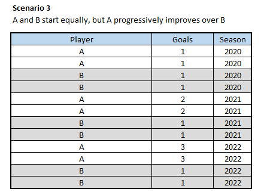

# MLS Soccer analytics using meta-metrics: Discrimination and Stability

## 1. Soccer analytics

Just like any major sport, soccer is replete with statistics. Unlike games such as NFL, NHL or cricket, soccer is a fluid game with momentary stoppages in the flow. The game result is decided by a scoreline of goals and teams often go in long spells goal-less period. A vast majority of the games yield a total of less than 3 goals. Thus it becomes a challenge to evaluate the game performance of players when there are very few visibly decisive moments in the game. Player performance evaluation is thus largely based on his/her on-ball moments. These include metrics such as pass completion percentage, shots on target, header won, tackle completion percentage and so on. Some of these metrics are aggregated to assess the performance of the team, while others such as expected goals are popular in the media to indicate the attacking intent of the team during the course of the game. How do we determine whether a metric is good or bad - i.e. does the metric reflect the true performance levels of the players/team. How can we assess this? 

## 2.1 Understanding Meta-metrics

Meta-metrics are aimed to assess the quality of an evaluation metric. They can be useful in the process of constructing new metrics by enabling us to refine the evaluation metric. Two such meta metrics that I found insightful are Discrimination and Stability. These are discussed in depth in the paper "Meta-Analytics: Tools for Understanding the Statistical properties of Sports Metrics" by Alexander Franks et. al.

I will briefly describe these two meta metrics and delve into their application on data collected on Major League Soccer. The meta-metrics in this article are written with respect to assessing evaluation metrics for players.

### 2.2 Discrimination

Discrimination is an indicator of how effective is the evaluation metric in differentiating between the players in a specific season. The discrimination value indicates the fraction of between-player variance in the evaluation metric `m` that can be attributed to the player's ability.

$$D_{sm} = 1 - \frac{E[V_{spm}[X]]}{V_{sm}[X]}$$

where,

$m$: evaluation metric

$s$: season

$E[V_{spm}[X]]$: expected value (mean) of the metric variance (population) of each player in that season.

$V_{sm}$: metric variance (population) in that season.

If we have several seasons to evaluate, the overall discrimination score  can be compute by taking the mean.

$$D_{m} = E_m[D_{sm}]$$ 

The Discrimination score ranges from 0 to 1, where a higher score indicates that the evaluation metric differentiates the players in that season.

### 2.3 Stability

Stability is an indicator of how consistent is the evaluation metric across the seasons. An evaluation metric can be unstable if it is highly dependent on context or confounding factors. For example, player performance fluctuating due to change in teammates from season to season, player performance drop due to injuries. Thus without the blocking of these confounding factors the evaluation metric cannot reliably provide a true indication of the player ability. The stability score is low for such evaluation metrics. With several confounding factors present in a soccer game such as the aforementioned teammates', injury, home/away games, weather conditions, etc. it can be challenging to design evaluation metrics that can be stable.

Stability is computed using the following formula. The formula returns a score between 0 and 1, where a higher score reflects the evaluation metric being more stable, and vice versa.

$$ S_m = 1 - \frac{E_m[V_{pm}[X]-V_{spm}[X]]}{V_{m}[X]-E_m[V_{spm}[X]]} $$

where,

$V_m[X]$ represents the total variance of the metric (population).

$V_{pm}[X]$ represents the between-season variance of the metric (population).

$V_{spm}[X]$ represents variance of the metric (population) of each player in each season.

#### 2.4 Example

Let me explain Discrimination and Stability using an examples. The computation can be found in the spreadsheet [here](data/example_meta-metrics_calculation.xlsx).

Consider an imaginary example where the population is comprised of only two players, A and B. They play two games in each season from 2020 to 2022. For simplicity, let us consider the evaluation metric is `Goals`.

##### Scenario 1
Let's assume that both A and B perform equal to each other. Moreover, they replicate their performance in all the seasons. This is shown below:

In scenario 1, the computation of Discrimination and Stability, for each season and average Discrimination is as follows:

Due to the players being perfectly equal in performance to each other and across each season, the Discrimination and Stability and is zero. This is a far-fetched scenario that may not be realistically encountered in practical life.

##### Scenario 2
In scenario 2, A performs better than B in all seasons. B performs consistently across seasons.

The computation is as follows:

The Discrimination is high in each season, which indicates that `Goal` as an evaluation metric differentiates the players in that season. 
The Stability is computed for all seasons together. It is appreciable at 0.72, and reflects the consistent pattern (A performing better than B across all seasons)

##### Scenario 3
In scenario 2, A and B are equal in 2020. However A progressively improves compared to B over the next two seasons. This scenario is of particular interest to analysts who might be looking for player comparison assessments.

The computation is as follows:

The Discrimination continues to remain high for the season where A performs better than B. However the Stability drops to 0.42, due to the developing trend across the seasons. This infers that should players abilities change across a period of time, the Stability of the evaluation metric will fall across the same period of time.

##### Scenario 4
The scenario 4 is the one that is often encountered with data. This is the scenario where there is no discernible trend in the player performances. Sometimes A performs better than B and vice versa. 

The computation is as follows:

In such cases the Discrimination and Stability are both low, indicating that there might be too much noise in the evaluation metric to effectively differentiate the players. In such cases it is necessary to improve the data, through improved metric design, data collection and developing context. Discrimination and Stability can thus be used to aid in the aforementioned metric design and improvement processes.

## 3. American Soccer Analytics (ASA)

I came across this [blog](https://www.americansocceranalysis.com/what-are-goals-added) on [www.americansocceranalytics.com](https://www.americansocceranalysis.com/). The author introduces and discusses in depth the evaluation metric of `goals-added`. This innovative metric is designed to award fractional points to players whilst considering the influence of their action on the gameplay. Each action of a player: dribbling, passing, intercepting, shooting etc. contributes to his/her tally of fractional goals added . Likewise a misplaced pass leading to a turnover, poor clearance etc. leads to a deduction from the tally of fractional goals added. The concept behind this metric is explained in detail in the [blog](https://www.americansocceranalysis.com/what-are-goals-added) in two parts. I recommend you to read it if you are interested to understand the intricacies involved.

## 3.1 Applying meta-metrics on MLS data

Unlike the traditional metrics such as goals, assists, passes, tackles etc., the `goals-added` rewards the players depending on the context. It is intriguing to think how this innovating metric fares in terms of our meta-metrics: Discrimination and Stability.

As we saw in the above example - scenario 4, the Discrimination and Stability meta-metrics can yield low values when the dataset is replete with noise. Confounding factors such as playing position, home/away games, match situations, opposition strength are some of the factors that introduce noise into the measurement. While `goals-added` metric does build context depending on the unfolding chain of events, it is not fully evident if the rewarding system scales depending on each of the above confounding factors.

Thus to construct a fair assessment, I filtered data for specifically the players designated as midfielders in the MLS between 2018 to 2023. The code for making the API call and filtering the dataset is available [here]('api_eda.ipynb').

The analysis is thus performed on a subset of 57 midfielders who played each season from 2018 to 2023. It is worth noting that only the metrics from games where the played atleast 30 minutes are considered for the evaluation. This is heuristic estimate of the minimum play time necessary for the player to influence the game. This approach eliminates the confounding factor of player position.

## 3.2 Metrics

The Discrimination is computed for each season of a number of evaluation metrics. These are:
* `Dribbling` (Goals added from dribbling action)
* `xpass_completion_percentage` (expected pass completion percentage)
* `Passing` (goals added from passing action), 
* `attempted passes`
* `Interrupting` (goals added from interception action)
* `Shooting` (goals added from shooting action)
* `Receiving` (goals added from receiving pass action)
* `goals_added_total` (goals added sum from all actions)
* `xassists` (expected assists)
* `Fouling` (goals added from fouling action)
* `xgoals` (expected goals)

Note that `xpass_completion_percentage`, `xassists` and `xgoals` are traditional metrics that do not use the goals added concept.

## 3.3 Results

The Discrimination and Stability measures for each metric is shown as a heatmap below and shows some interesting results.

The traditional metrics `xpass_completion_percentage` and `attempted_passes` provide relatively high Discrimination and Stability scores.
The traditional metric `xassists` comes next with a mid Stability score, however it's Discrimination hovers around 0.2
Likewise the traditional metric `xgoals` performs similarly.

The `goals_added_total` and its component `Passing` show a similar performance. with a mid Stability score and Discrimination hovering around the 0.2 mark.

The change in Discrimination across the seasons can be better visualized as a lineplot.

### 3.4 Inference

What can we infer from the above analysis?

Both Discrimination and Stability are meta-metrics that are largely dependent on nature of the data in the evaluated metric. The noise in the evaluated metric needs to be minimized through data collection or data analysis methods to ensure that the evaluation metric provides a measure of player's ability. 

Thus, there is no specific threshold that defines a 'good' Discrimination or Stability score. These scores should be used as a supplement to other contextual information. They could even be used to compare and improve design of the evaluation metrics. 

Other notable inferences:

* The data is evaluated without consideration of any confounding factors other than the player position. Different Players in the same playing position can posses different playing styles which can skew the evaluated metric. Thus there are layers of confounding factors that needs to be controlled for data collection and subsequent analysis.
* The researchers state in their paper that Stability is higher for per-minute or per-game metrics (normalized metrics). This could explain why the `xpass_completion_percentage` has that highest Stability amongst the considered evaluation metrics.
* The researchers mention in their paper that metrics which don't change over time, and aren't influenced by player's physical deterioration, have high Stability but low Discrimination. Attempted passes falls under this purview provided the player's playing style remains fairly consistent across seasons.

### 4. Recommendations

* The analysis shows that meta-metrics need to be evaluated in conjunction with contextual information. There are not specific thresholds that qualify a meta-metric as being good or bad. Thus it is necessary to always make relative assessments with prior meta-metric values.
* Recognizing confounding factors, controlling them during data collection and then minimizing their influence during analysis is important to improve objectivity of the meta-metric.
* It is important to understand which meta metric is applicable to the question being asked. A high Discrimination and Stability isn't necessarily the desirable scenario. For example, the scope of Discrimination is within each season, whereas Stability is measured across multiple seasons. Thus Discrimination is used to indicate anomalies, player's evaluation metrics that are above or below the general performance of the sample set under consideration. Stability on the other hand is a reflection of consistency across the seasons of the sample set under consideration.

## References

* Academic paper: [Meta-analytics: tools for understanding the statistical properties of sports metrics](https://www.degruyter.com/document/doi/10.1515/jqas-2016-0098/html?lang=en)

* Github repository: [itscalledsoccer](https://github.com/American-Soccer-Analysis/itscalledsoccer/)

* API to explore and manually download MLS data: [Api](https://app.americansocceranalysis.com/api/v1/__docs__/#/)
